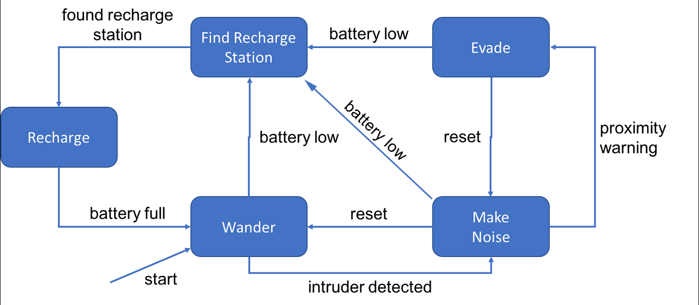

SecurityBot
===
A robot finite state machine built from the elma libraries found [here](https://github.com/klavinslab/elma).  The goal of the project is to create a simulation of the robot in a 2D environment and to output a visualization of the robot's state over time.

Project Plan
===
This list of milestones in the project:
- [x] Get the robot finate state machine running in order to pass the grading file (due: March 17th---completed: March 17th)
- [x] Update the README.md file to include installation instructions (due: March 17th---completed: March 17th)
- [x] Add a coordinate system to the robot structure  (due: March 20th---completed: March 18th)
- [x] Research what visualization tools exist for c++ (due: March 17th---completed: March 15th) 
- [x] Impliment UI tool into the program (due: March 20th---completed: March 17th)
- [x] Impliment visualization of coordinate system into the program (due: March 20th---completed: March 19th )
- [x] Add API documentation (due: March 20nd---completed: March 19th )
- [x] Add simulations of the battery state (due: March 22nd---completed: March 19th )
- [x] Update unit tests for all methods (due: March 19th---completed: March 20th )
- [x] Add coordinates for recharge station (due: March 19th---completed: March 20th )
- [x] Add details to findRechargeMoveFunction (due: March 19th---completed: March 20th )
- [x] Add details to rechargeFunction (due: March 19th---completed: March 20th )
- [x] Add simulations of the intruder state (due: March 22nd---completed: March 21st )

- [ ] Add details to makeNoiseFunction (due: March 19th---completed: ??? )
- [ ] Add details to evadeMoveFunction (due: March 19th---completed: ??? )
- [ ] Finalize API documentation (due: March 22nd---completed: ??? )
- [x] Create a docs page in GitHub (due: March 22nd---completed: March 19th )
- [ ] Submit the final version to GitHub (due: March 22nd---completed: ??? )


# Installation
In order to build and run the SecurityBot program you will need the following:

## I)  An installation of [Git](https://git-scm.com/)
(Which you probably already have if you are reading this.)
### Mac
1. Install the Xcode Command Line Tools.
### Windows
1. Go to https://git-scm.com/download/win

## II)  An installation of [Docker](https://www.docker.com/)
### Mac
1. Go to https://www.docker.com/
2. Download `Docker.dmg` and double click on it. Once the Docker icon shows up in your status bar, you can open a terminal and start using docker.
### Windows 10 Professional or Enterprise
1. Go to https://www.docker.com/
2. Download and run installer
### Windows 10 Home and possibly Windows 8
1. Go to https://docs.docker.com/toolbox/toolbox_install_windows/
2. Download and run installer
3. Run Docker Quickstart

## III)  An integrated development environment "IDE": I've used [Visual Studio Code](https://code.visualstudio.com/)
1. Go to https://code.visualstudio.com/
2. Download and run installer

## IV)  A copy of the SecurityBot software
Use git to clone SecurityBot into a local folder.
Open "git bash" program in the folder you wish to download the software and run the following command:
```bash
git clone https://github.com/klavins/ECEP520.git
```
## V)  A C++ Build Environment From Dockerhub
Next you will need a C++ build environment in order to compile the newly downloaded software.  I recommend a build environment that has all the necessary elma libraries already built into it.  This environment, called a Docker container, has all the necessary OS setup and libraries for the SecurityBot program to compile correctly.  The Docker container I recommend is called "elma".
In order to use this container you need to open a shell terminal, navigate to the directory in which you downloaded the SecurityBot source code, and type the following:
```bash
docker run -v $PWD:/source -it klavins/elma:latest bash
```
Note: $PWD may not work on all Windows OS so replace with full path for example:
```bash
docker run -v /c/workingDIRECTORY/SecurityBot:/source -it klavins/elma:latest bash
```      

# Manual Installation
It is not recommended to install Elma without using Docker.  If you desire to do so anyway, you can view instructions [here](https://github.com/klavinslab/elma/blob/master/README.md#manual-installation)


# Detailed System Description
SecurityBot is a statemachine that models the following diagram:



# License
This software is open source and uses the MIT license. Details can be found [here](https://github.com/steveolio/SecurityBot/blob/master/LICENSE).